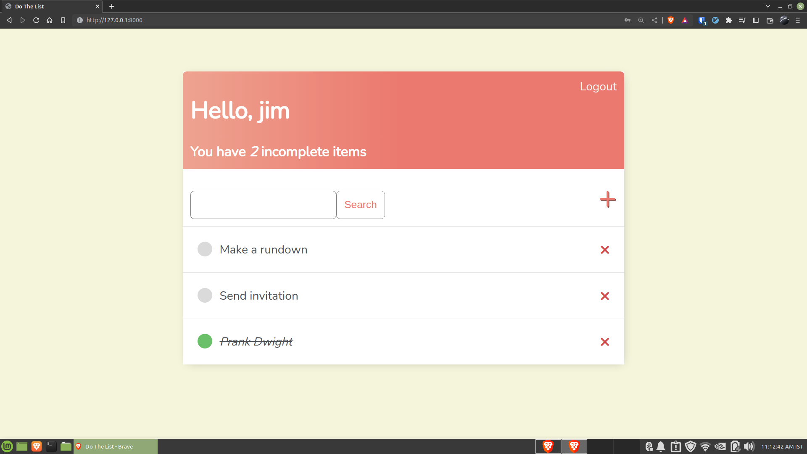
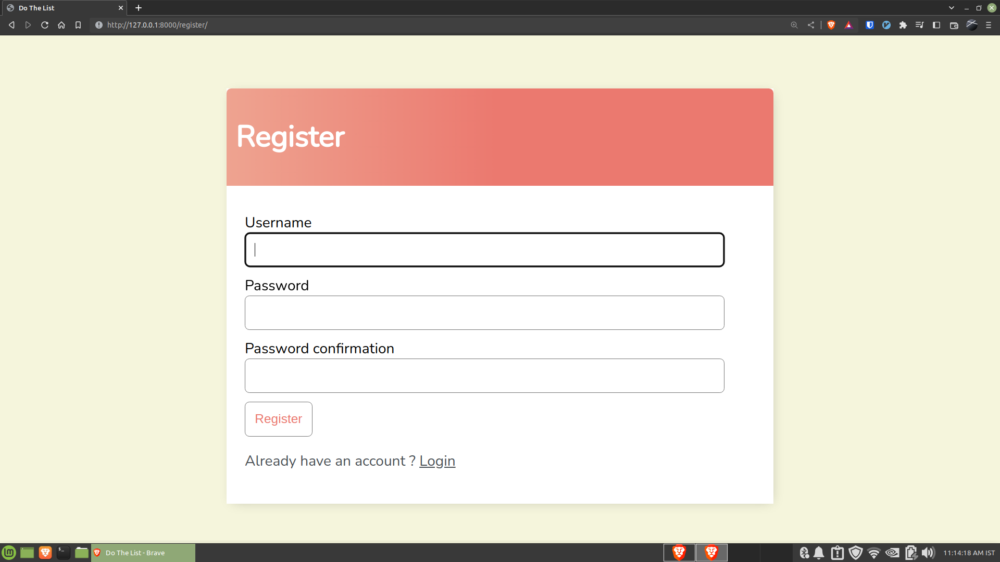
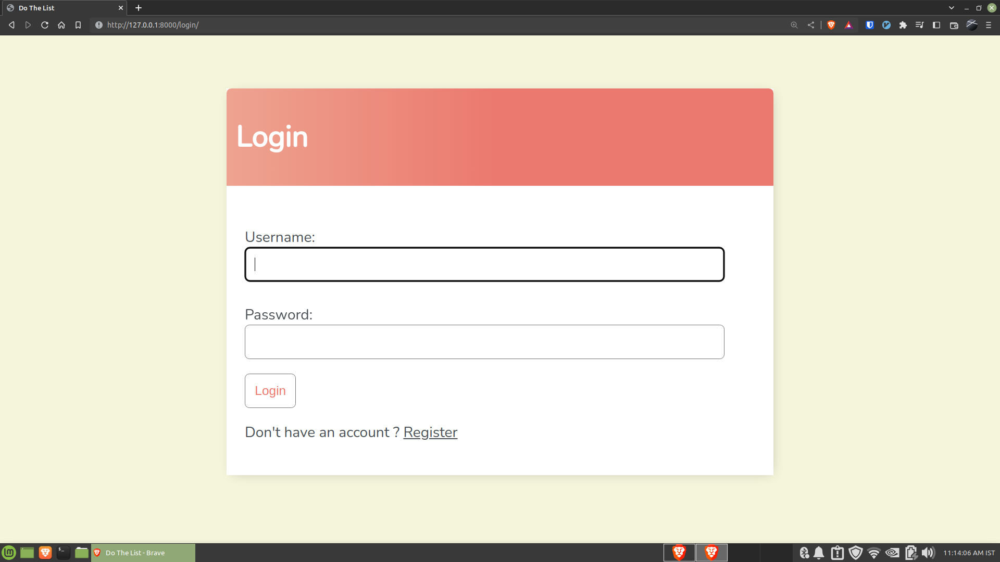
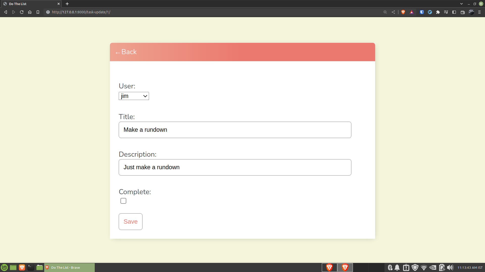

## A simple todo list app created using Django

## Installation

1. Clone the repository
2. Create a virtual environment
3. Install the requirements
4. Run the migrations
5. Run the server

## Usage

1. Create a superuser
2. Login to the admin panel
3. Create a todo list
4. Add items to the list
5. Mark items as completed

## Contributing
Pull requests are welcome. For major changes, please open an issue first to discuss what you would like to change.

# Screenshots

## License
[MIT](https://choosealicense.com/licenses/mit/)